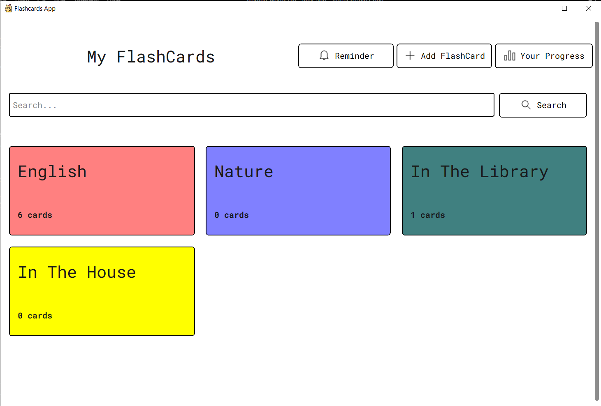

# Tkinter Flashcards:

### This is an Flashcards App that lets you :
* Create, Edit, Delete and Show all your FlashCards and Cards.
* Filter FlashCards by name.
* Test your memory with a simple test
* Show your progress of learning
* Remind you of words you forgot

### Techologies Used :
* Python
* Tkinter
* CustomTkinter
* Pandas
* Matplotlib

### App ScreenShot :

 
 

